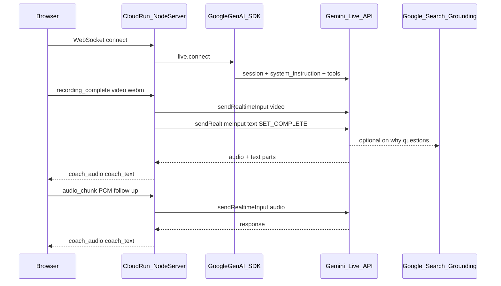

# APIs the project uses (current design)

## Summary


| Layer                  | APIs / services                                                                                       |
| ---------------------- | ----------------------------------------------------------------------------------------------------- |
| **Browser (Daniel)**   | WebSocket, `getUserMedia`, Web Audio, `MediaRecorder` (planned) — **no Gemini from the client**       |
| **Backend (Eli)**      | **Google GenAI SDK** (`@google/genai`) → **Gemini Live API** + **Google Search grounding**            |
| **Dev / verify (Eli)** | REST `generateContent` (one-time curl to test API key)                                                |
| **Hosting (Eli)**      | **Google Cloud Run** (+ optional `gcloud` deploy APIs) — not a Gemini API, but required for hackathon |
| **Diego (testing)**    | **Google AI Studio** (same Gemini models, manual testing)                                             |





---

## 1. Google Gemini (primary — all AI)

**SDK:** `[@google/genai](https://www.npmjs.com/package/@google/genai)` in [EliTasks.md](EliTasks.md) `server/index.js` (documented; `**server/` not in repo yet**).

**Endpoint family:** Gemini **Live API** (real-time multimodal session), not batch `generateContent` for coaching.


| Call            | Method / input                                                             | Purpose                  |
| --------------- | -------------------------------------------------------------------------- | ------------------------ |
| Open session    | `client.live.connect({ model, config })`                                   | Start Coach session      |
| Model           | `LIVE_MODEL` e.g. `gemini-2.0-flash-live-001` (confirm with Diego)         | Live audio + video       |
| System prompt   | `system_instruction: buildSquatPrompt()`                                   | Post-set review behavior |
| Audio output    | `response_modalities: [Modality.AUDIO]`                                    | Coach speaks             |
| After Stop      | `sendRealtimeInput({ video: { data, mimeType: 'video/webm' } })`           | Full recorded set        |
| Trigger opening | `sendRealtimeInput({ text: 'SET_COMPLETE: ...' })`                         | Coach speaks first       |
| Follow-up       | `sendRealtimeInput({ audio: { data, mimeType: 'audio/pcm;rate=16000' } })` | User talks back          |


**Grounding (hackathon robustness):**

```javascript
tools: [{ google_search: {} }]
```

Google Search is invoked **inside the Live session** when the model needs it (e.g. "why do my knees cave?") — not a separate REST call you write.

---

## 2. One-time REST check (setup only)

From [EliTasks.md](EliTasks.md) Phase 1 — **not** used in the app loop:

```
POST https://generativelanguage.googleapis.com/v1beta/models/gemini-2.0-flash:generateContent?key=API_KEY
```

Purpose: verify the hackathon API key works before building the server.

---

## 3. Browser APIs (frontend — no Google keys in client)

From [client/src/hooks/useCoachSession.js](client/src/hooks/useCoachSession.js) and [DanielTasks.md](DanielTasks.md):


| API               | Current code                    | Target (per docs)                           |
| ----------------- | ------------------------------- | ------------------------------------------- |
| **WebSocket**     | `ws://` / `wss://` to Cloud Run | Same                                        |
| **getUserMedia**  | Camera + mic                    | Same                                        |
| **Canvas + JPEG** | `video_frame` every 500ms       | **Remove** — replace with **MediaRecorder** |
| **MediaRecorder** | Not implemented                 | `recording_complete` on Stop                |
| **Web Audio**     | Mic PCM16 + play Coach audio    | Same for follow-up                          |


The browser **never** calls `generativelanguage.googleapis.com` directly.

---

## 4. Google Cloud (hosting — mandatory for judging)


| Service                                            | Role                                          |
| -------------------------------------------------- | --------------------------------------------- |
| **Cloud Run**                                      | Hosts Node server; public `https://*.run.app` |
| **Cloud Build** (via `gcloud run deploy --source`) | Builds container on deploy                    |
| **Hackathon GCP project + API key**                | Billing + Gemini access                       |


Portal: [goo.gle/CHM-hack-26](https://goo.gle/CHM-hack-26)

---

## 5. What Diego uses in AI Studio

Same **Gemini Live** (and/or video-in-chat) through the Studio UI — not a separate product API from the team's code. Model + prompt tested here should match `LIVE_MODEL` + [DiegoTasks.md](DiegoTasks.md) canonical prompt.

---

## 6. Implementation gap (important)


| Piece                                                                      | Status                                            |
| -------------------------------------------------------------------------- | ------------------------------------------------- |
| [EliTasks.md](EliTasks.md) server design                                   | Documented                                        |
| `server/` in repo                                                          | **Missing**                                       |
| [client/src/hooks/useCoachSession.js](client/src/hooks/useCoachSession.js) | Still `**video_frame`** streaming (old live flow) |


Until Eli ships `server/` and Daniel switches to `recording_complete`, the **running app** does not yet call the APIs in section 1 — only the **docs** describe them.

---

## What you (Diego) touch

- **AI Studio** — Gemini Live + prompt (no server code)
- **Confirm** `LIVE_MODEL` string and prompt for Eli
- **Test** grounding via follow-up "why" questions once server is live

You do **not** call Cloud Run, GenAI SDK, or REST `generateContent` yourself.